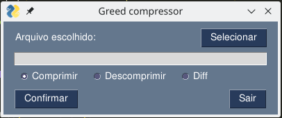
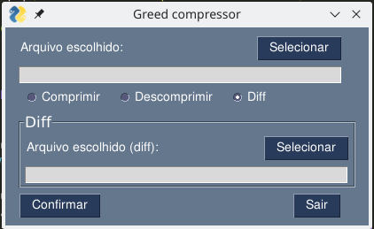
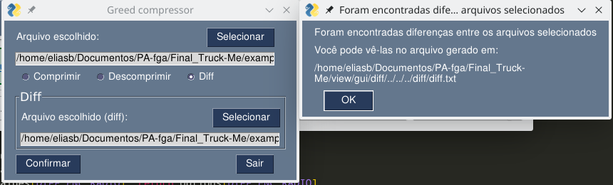
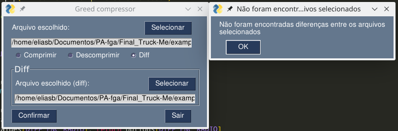
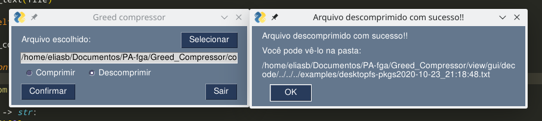
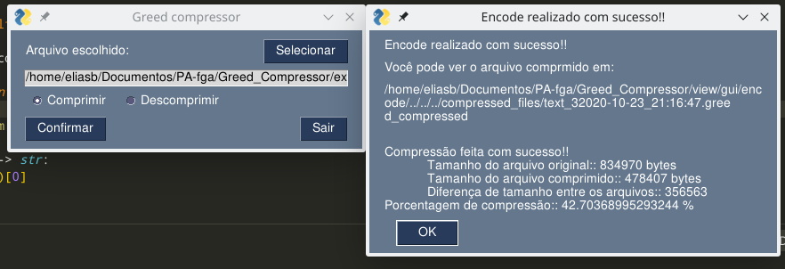
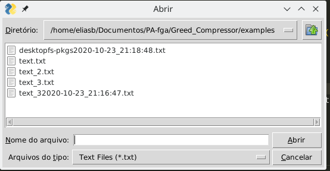

# Greed Compressor

**Conteúdo da Disciplina**: Trabalho final 
**Tema**: Compressão de dados & Diff

## Alunos
|Matrícula | Aluno | GitHub |
| -- | -- | -- |
| 15/0009011  |  Elias Bernardo | @ebmm01
| 17/0141161  |  Erick Giffoni | @ErickGiffoni

## Sobre 

__Coé__ faz compressão e descompressão de arquivos _txt_ além de adicionar uma nova funcionalidade ao [Greed Compressor](https://github.com/projeto-de-algoritmos/Greed_Compressor). A ideia é ver qual é (__Coé__) a diferença entre 2 arquivos, se houver. Os arquivos são comparados por meio de um algoritmo de _diff_, sendo que ambos podem estar no formato _txt_ ou comprimidos no formato _greed_compressed_ (e combinações desses formatos entre os arquivos são aceitas, ou seja, é possível comparar um arquivo _txt_ com um _greed_compressed_ e vice-versa, por exemplo).

Nesse sentido, Coé utiliza: grafos, algoritmo ambicioso de Huffman e programação dinâmica com algoritmo de _diff_, o qual baseia-se no problema da [_Longest common subsequence_](https://en.wikipedia.org/wiki/Longest_common_subsequence_problem)

**Linguagem**: Python 3.8 
**Biblioteca(s)**: [bitstring](https://pypi.org/project/bitstring/)

### Requisitos para utilizar esse projeto

- conexão de internet; 
- terminal/console/shell no computador; 
- pip & venv
- **Python 3.8+** (necessariamente)
- clonar o projeto;

> Para clonar o projeto digite:

    git clone https://github.com/projeto-de-algoritmos/Final_Coe

## Screenshots

- Tela inicial

- Tela inicial ao escolher a opção de diff

- Tela de sucesso ao realizar o diff entre dois arquivos

- Tela de erro ao tentar fazer o diff entre arquivos de conteúdos idênticos

- Tela de sucesso ao descomprimir um arquivo

- Tela de sucesso ao comprimir um arquivo

- Tela de seleção de arquivo

## Instalação 

Após fazer o clone do projeto, siga os passos abaixo :

- entre na raiz do projeto

>
    $ cd Final_Coe/

- (Opcional) Caso não possua uma venv, gere uma:

>
    $ python -m venv <nome da venv>

- (Opcional) Ative a venv caso não esteja:

> Note que o comando abaixo pode variar de acordo com o sistema operacional. Em caso de dúvidas veja a [documentação](https://docs.python.org/pt-br/dev/library/venv.html)
>
    $ source venv/bin/activate

- instale as dependências

>
    $ python -m pip install -r requirements.txt

- execute o projeto

>
    $ python -m view.gui.main

## Uso 

O uso da interface é auto explicativo.

- Vídeo de apresentação:
    - YouTube: [clique aqui](https://youtu.be/cgA7xKcNwN4)
    - mp4: [pasta images](./images/terminal_video.mp4)

## Problemas ? Sugestões ?

Caso você tenha alguma dificuldade, sugestão ou algum problema com o projeto, 
por favor entre em contato conosco:

- Elias Bernardo - ebmm01@gmail.com - telegram @ebmm01
- Erick Giffoni - giffoni.erick@gmail.com - telegram @ErickGiffoni 
